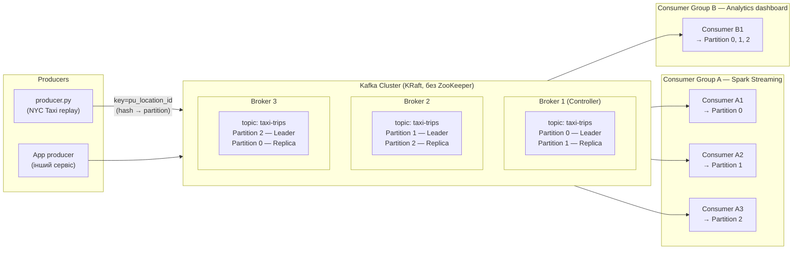
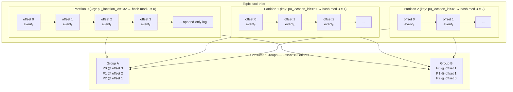
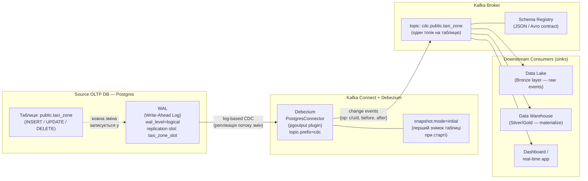
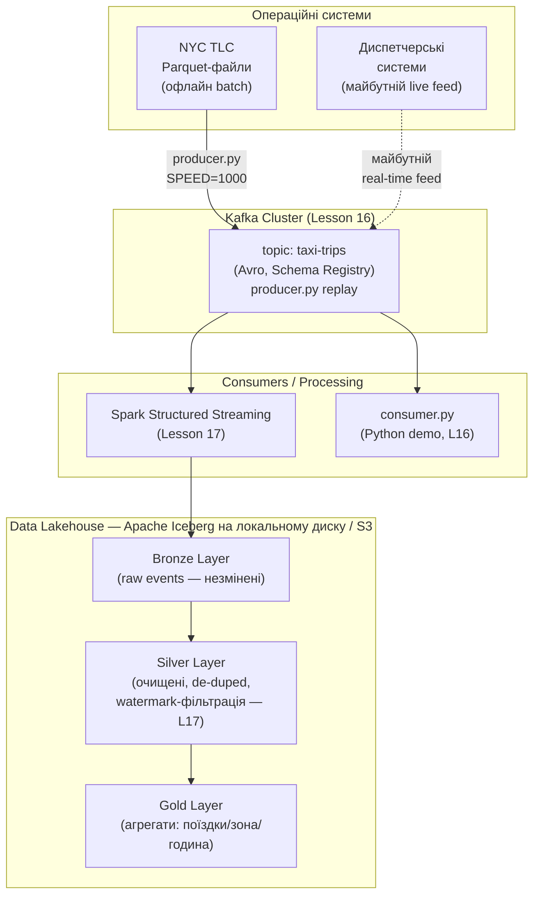

# Діаграми: Потокова обробка даних. Частина 1 — event brokers

Чотири Mermaid-діаграми для Lesson 16. Розкривають архітектуру Kafka від рівня cluster
до рівня CDC pipeline та загального контексту medallion-архітектури проєкту.

---

## 1. Kafka — основна архітектура

Kafka Cluster складається з кількох broker-ів. Кожен broker зберігає певні partition-и як
Leader (приймає запис/читання) і решту як Replica (резервні копії). Producer надсилає
повідомлення з ключем — broker маршрутизує до partition за формулою
`partition = hash(key) % num_partitions`. Дві consumer groups читають той самий topic
незалежно: Group A розподіляє партиції між трьома consumer-ами (паралелізм),
Group B читає всі partition одним consumer-ом. Ordering гарантований лише всередині
однієї partition.

---

## 2. Topic / partition / offset — деталь

Кожна partition — це append-only ordered log. Нові events дописуються в кінець;
старі не видаляються (до закінчення retention, default 7 днів). Offset — монотонно
зростаючий ID події всередині partition, що дозволяє replay: consumer може перечитати
дані, встановивши offset назад. Ключ повідомлення (`pu_location_id` у прикладі проєкту)
визначає partition через хеш — всі поїздки з одного zone потрапляють до однієї
partition, забезпечуючи локальний ordering per zone. Кожна consumer group зберігає
свій власний offset у внутрішньому топіку `__consumer_offsets` — Group A і Group B
читають повністю незалежно.

---

## 3. CDC pipeline (Change Data Capture)

> Концептуальна діаграма — слайди, без live-демо цього заняття (`code/` більше не
> піднімає Postgres/Kafka Connect/Debezium; спрощення стеку).

**Log-based CDC vs query-based polling:**

| | Log-based CDC (Debezium + WAL) | Query-based polling |
|---|---|---|
| Механізм | Читає WAL / binlog бази даних | Виконує `SELECT WHERE updated_at > last_run` |
| Overhead на БД | Мінімальний | Зростає з розміром таблиці |
| DELETE видимий? | Так — через WAL | Ні — рядок вже видалено |
| Затримка | Мілісекунди | Хвилини (залежить від polling interval) |

Debezium читає PostgreSQL WAL через replication slot (`pgoutput` plugin), перетворює
кожну зміну рядка на change event з полями `op` (c=create, u=update, d=delete),
`before` (стан до) і `after` (стан після) — і публікує в Kafka topic `cdc.public.taxi_zone`
(формат: `{prefix}.{schema}.{table}`). Downstream consumers отримують повний потік змін
у реальному часі без додаткового навантаження на БД.

---

## 4. End-to-end streaming — Kafka у medallion-архітектурі NYC TLC

Kafka є центральним event broker-ом між операційними системами та аналітичним
Lakehouse. На Lesson 16 встановлюється інфраструктура: producer публікує NYC TLC
taxi trips як Avro events (ключ = `pu_location_id` → ordering per zone). Consumer Group A
(Spark Structured Streaming) підключиться у Lesson 17 — саме там з'являться watermark,
late data handling і запис у Bronze/Silver шари Iceberg. Константа `LATE_EVENT_FRACTION`
у `producer.py` вмикається (вручну, у файлі) у L17 для демонстрації watermark-поведінки.
CDC (діаграма 3 вище) сюди навмисно не включений — цього заняття він лишається
слайдовим матеріалом, без живого Postgres/Debezium у `code/`.
